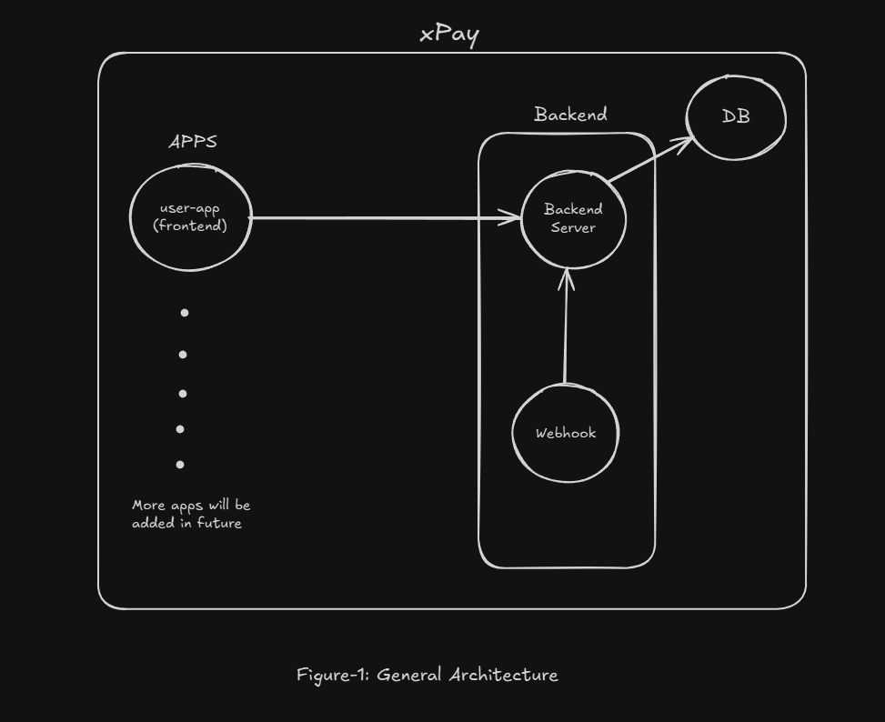
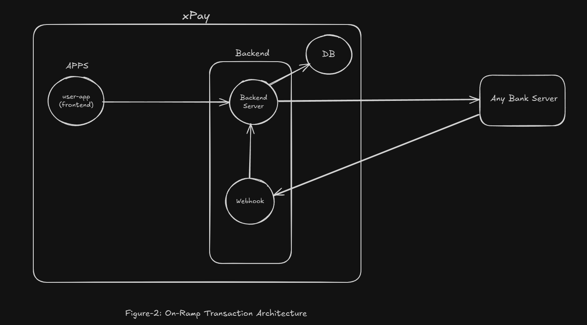

# What is xPay

A mini-scale digital wallet, similar to Apple Pay or PayPal, that simulates peer-to-peer fund transfers and wallet top-ups from a bank.

## Features

- `Bank Transfer`: Individual users can transfer money from their bank to their wallet.
- `p2p Transfer`: For non-merchant users, peer-to-peer transfers are implemented with protection against concurrent transaction misuse.
- `Transcation History`: Users can view all their transactions, whether payments or transfers, through a dedicated history interface.
- `CI-CD pipeline`: Build a ci cd pipeline for aws deployment.


## Architectures 


### General Architecture


The figure-1 above represents main system architecture which is separated to two parts – apps or frontends, backend system- consists of a server ,webhook and a PostgreSQL db cloud instance.

### On-Ramp Architecture


For, figure-2 represents on ramp or simply bank to wallet transfer transaction. Users apps fund transfer request is goes to backend server that talks to both db and desired bank. After, sending the request of frontend the server primarily update the transaction as processing ; when the bank finally sends response ,either success or failure,  it goes to webhook server that will push it to the main server, and update the specific db transaction status. For, simulating a bank server is built and test is ran through postman.

### p2p transfer

For, peer to peer transfer between to two users both need to be register with the xPay systems.


## Installation 

To install, run the following command:

```
cd digital-wallet-app-monorepo
npm install
npm run build
npm run dev
```

or, if you want run the project as docker container , run the following ---

```
TBD
```

## API Reference

### Create On-Ramp Transaction

Type: Next.js Server Action
Function: createOnRampTransaction(provider: string, amount: number)
Auth Required: Yes (NextAuth session)

**Description**

Creates a new on-ramp transaction (wallet top-up) from a banking provider .
The transaction starts in a Processing state until confirmation is received from the provider.

**Request**

| Name       | Type     | Required | Description                                                            |
| ---------- | -------- | -------- | ---------------------------------------------------------------------- |
| `provider` | `string` | Yes    | Banking provider identifier (e.g., `"citi"`, `"axis"`)                 |
| `amount`   | `number` | Yes    | Amount in **rupees** (stored as paise in DB by multiplying with `100`) |


**Example:**

```
await createOnRampTransaction("hdfc", 500);

Responses

{
  "message": "Done"
}

Error (401 / Unauthenticated):
{
  "message": "Unauthenticated request"
}

```

### Peer-to-Peer Transfer

Endpoint Type: Next.js Server Action
Function: p2pTransfer(to: string, amount: number)
Auth Required: Yes (NextAuth session)


**Description**

This server action enables peer-to-peer money transfers between two users.
It checks the sender’s balance, ensures sufficient funds, and transfers the specified amount to the recipient.

The operation is wrapped in a transaction to ensure atomicity and prevent race conditions (using FOR UPDATE locks).

**Request**

| Name     | Type     | Required | Description                                                                      |
| -------- | -------- | -------- | -------------------------------------------------------------------------------- |
| `to`     | `string` |  Yes    | Receiver’s phone number (must exist in the database)                             |
| `amount` | `number` |  Yes    | Amount to transfer (in smallest unit, e.g., paise if balance is stored that way) |

**Example:**

```
await p2pTransfer("9876543210", 200);

Responses

{
  "message": "Transfer successful"
}

Error (401 / Unauthenticated)

{
  "message": "Error while sending"
}

Error (404 / User Not Found)

{
  "message": "User not found"
}

Error (400 / Insufficient Funds)

{
  "error": "Insufficient funds"
}

```

## Techstack

- `Next.js`: For, frontend ui and simulating p2p, bank transfer operation to db.
- `express.js`: For, building webhook server that listens for particular bank fund transfer notification message.
- `Prisma` : As, Object realation model framework to work on postgresql db.
- `Neon.db`: Used for postgresql db instance.
- `docker`: For, dockernizing the app ,and creating images for ci-cd pipeline.
- `aws`: For, simulating CI-CD pipeline.
- `NextAuth.js`: For, authentication of users.
- `tailwindcss`: Styling the ui in frontend.
- `GSAP`: For, creating ui animations in frontend.


## Future Plans

TBD

